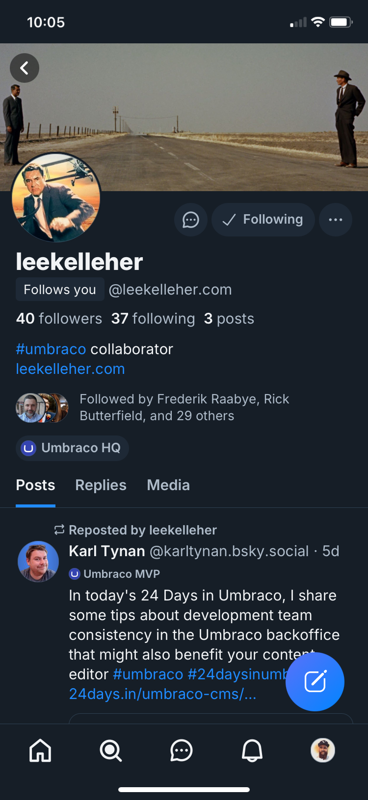

# Bluesky Umbraco Labeler

A [Bluesky labeler](https://docs.bsky.app/docs/advanced-guides/moderation) to highlight Umbraco HQ and MVP accounts



## Usage

In Blusky search for the [umbracolabeler.bsky.social](https://bsky.app/profile/umbracolabeler.bsky.social) account and click on the **Subscribe to labeler** button. Now in your feed, all HQ and MVP accounts should now get a shiny new labels on their profiles and all of their posts to highglight their status.

## Claiming a label

Highlighting of accounts is purely opt-in so if you'd like to display the label on your account you'll need to make a pull request to one of the `umbraco-hq.json` or `umbraco-mvp.json` files in the [data](data) directory.

Each file contains a JSON array of objects with the following schema:

```json
{
  "did": "string",
  "handle": "string"
}
```

The `did` field is the `did` of your account. You can find your did by using the an online tool such as https://ilo.so/bluesky-did/. The `handle` field is for your full Bsky handle, ie `umbracolabeler.bsky.social`

## License

Soure code is available under the [MIT LICENSE](LICENSE)
